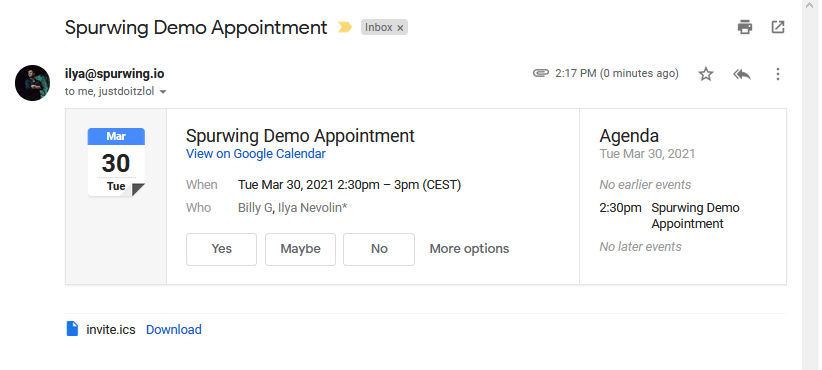
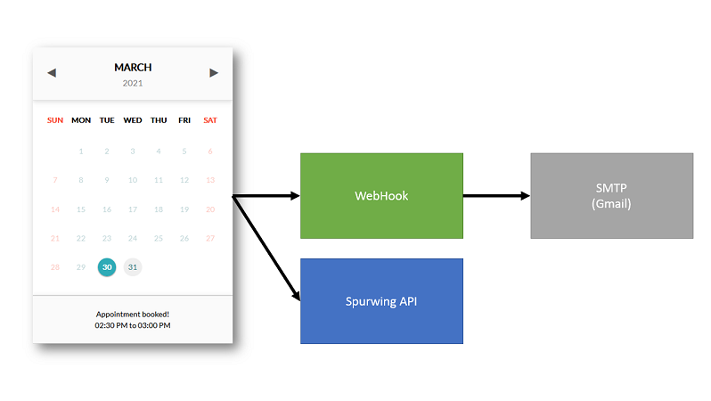
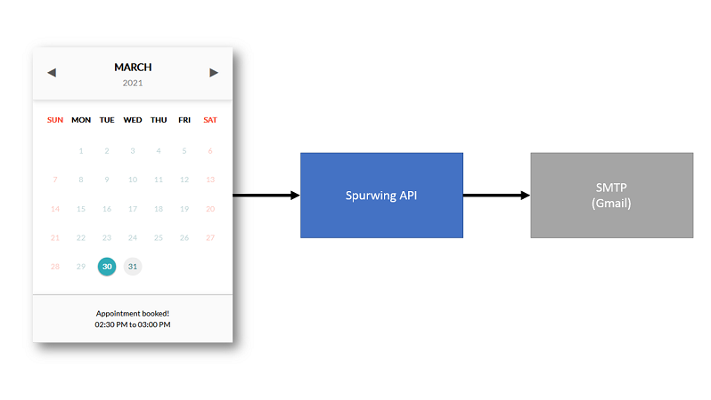

# iCalendar Integrations
This repository illustrates how you can use the iCalendar Protocol to schedule appointments, meetings and process bookings.


This NodeJS implemenation allows you to create iCalendar events and send them out by email to all attendees. These events are processed by all modern email systems (Gmail, Outlook, etc.) and look something like this:



## Architecture
This repository is a simple implementation of a WebHook REST service. Preferably you should integrate this code into your own back-end and not expose it for public access.



Flow analysis:

1. A client uses our front-end widget to book an appointment.
2. The Spurwing API receives and processes the client's request.
3. Upon success, the widget's code calls our WebHook.
4. The webhook creates an iCalendar event and emails the attendees.
5. Each attendee receives the email with RSVP options.

The flow above is actually a temporary workaround and insecure. Ideally, this flow should be simplified. The WebHook should be handled by a private service (not a public REST service). In our case it should be an add-on feature at the Spurwing API level, which is currently under construction:




## Configuration
To configure this WebHook service, you need to create a file config.js (or rename it) and enter the following credentials:

```js
module.exports = {
  organizer: {
    name: '',      // organizer's name
    email: '',     // organizer's email
    smtp_pass: '', // email password (or app password)
  },
  attendee: {
    name: '',      // host's name
    email: '',     // host's email
  },
}
```

It's important to note that we provide an organizer and an attendee (a.k.a host) in this configuration. The organizer could be a no-reply company email or an email account used only for sending automated emails. This shouldn't be your actual email account.

The attendee/host is actually yourself; the person who is scheduling an appointment with the client (from the website). This may look strange and weird, but the organizer is an email account which is not included in the appointment. It's simply an account used for sending out emails (but not a part of the actual meeting). However the attendee/host is included in the meeting.

It took some time to figure this out myself, the reason is this: when we use Gmail/Outlook to manually schedule an event, the organizer is also the attendee/host -- you do not receive the RSVP email because your Email Service already puts the event in your calendar. But here we do not directly access our calendar, instead we utilize the iCalendar protocol to send an email to ourselves and the client.

If you use the same email account for organizer and attendee/host, then you will not receive any email and will not be able to add it to your calendar. Because the iCalendar protocol assumes that your Email Service already does that for you.


## Support
- For public issues and bugs please use the GitHub Issues Page.
- For enquiries and private issues reach out to us at support@spurwing.io
- Join our Discord Community Server: https://discord.gg/j3gd5Qk5uW
- Learn more about the [Spurwing Scheduling API](https://github.com/Spurwingio/Appointment-Scheduling-API).
